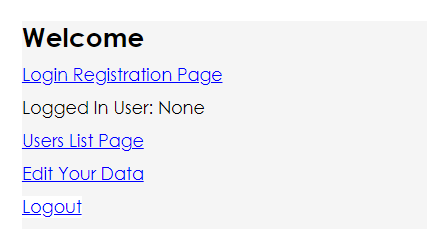
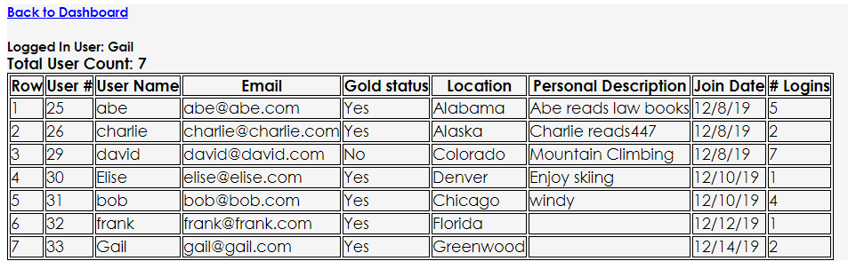
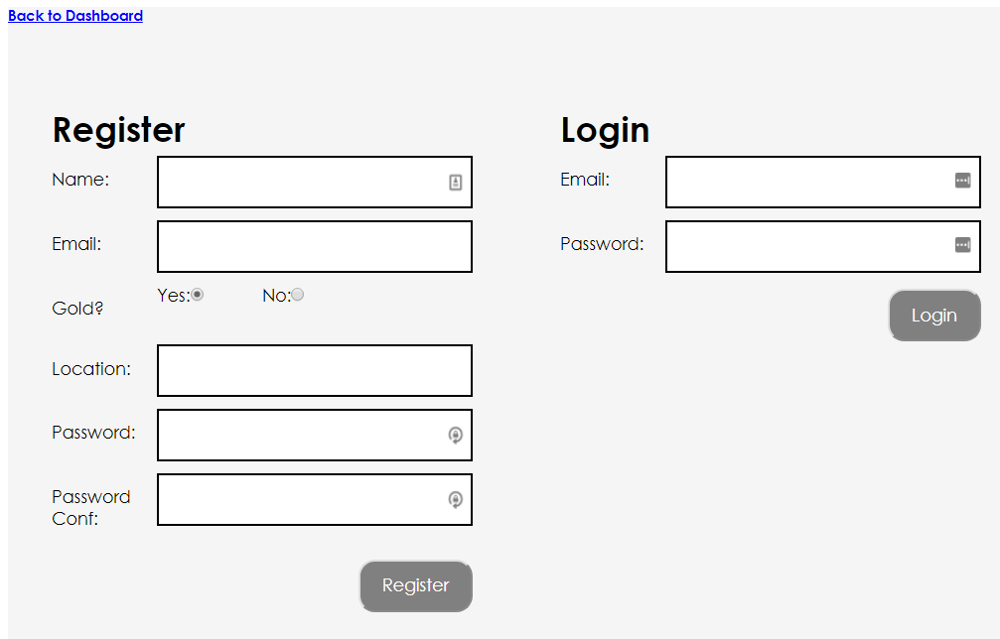
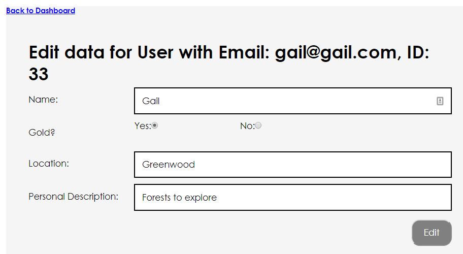

# Simple Spring Boot Registration login

Products and Customers is a simple web application serving as a demo and reference for login registration not using Spring Security

Attributes:  

  * MySQL database with one table/model.class file
  * JPA/Tomcat/JDK 1.8/JbCrypt with hashed passwords
  * Session tracks logged in user

# Installation
This is a Maven/Spring Boot project with default WAR settings

Spring Boot will populate your MySQL file.  Just create the file and if different, change in the application.properties file

[comment]: # (mvn spring-boot:run)

# Usage

  * View list of all users whether logged in or not
  * Logged in user can modify his/her data
  * Register/login/logout

# Selected Screenshots:

  
  

 

# Potential Future Features:
  * Add login history table and enable its view
  * API client based on user...maybe user's weather
  * User can store/leave messages for other logged in users to view

